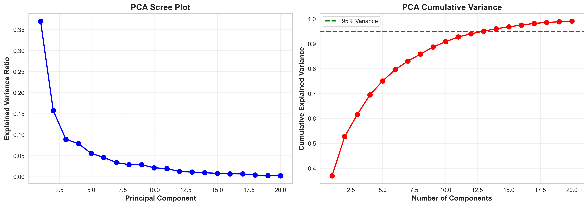
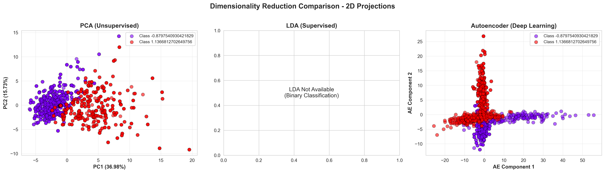
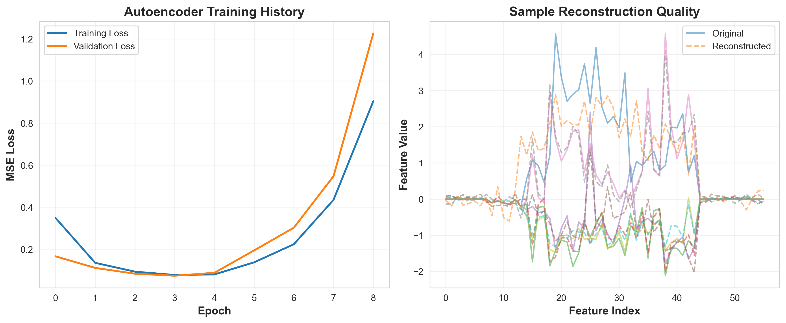
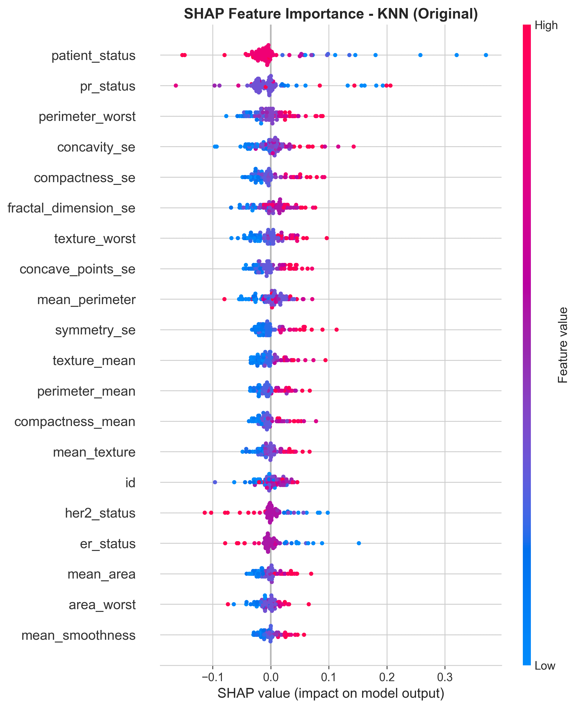
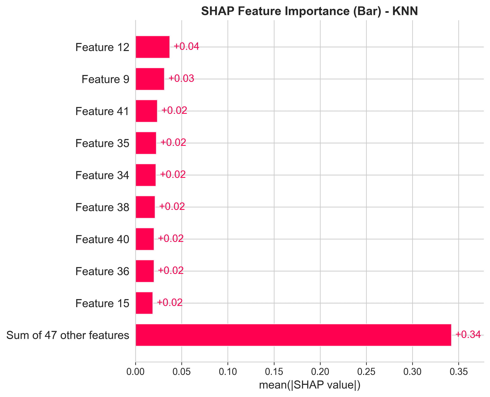
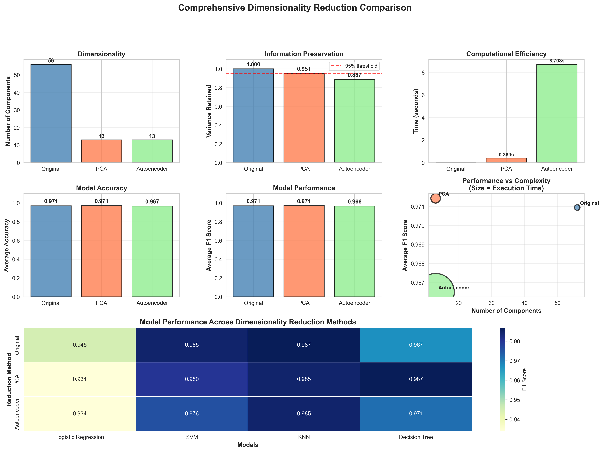

# 🧬 PCA:LDA Project - Machine Learning Analytics Dashboard

A comprehensive machine learning project that compares dimensionality reduction techniques (PCA, LDA, and Autoencoder) with interactive visualizations and model performance evaluation.

## 📋 Table of Contents

- [Features](#features)
- [Project Structure](#project-structure)
- [Installation](#installation)
- [How to Run](#how-to-run)
- [Features & Visualizations](#features--visualizations)
- [Generated Visualizations](#generated-visualizations)
- [Dataset Requirements](#dataset-requirements)
- [Usage Guide](#usage-guide)

## ✨ Features

### 🔬 Dimensionality Reduction Methods

1. **PCA (Principal Component Analysis)**
   - Unsupervised linear dimensionality reduction
   - Retains maximum variance in data
   - Configurable variance retention threshold
   - 2D and 3D visualizations

2. **LDA (Linear Discriminant Analysis)**
   - Supervised dimensionality reduction
   - Maximizes class separability
   - Works with binary and multiclass problems
   - 1D visualization for binary classification
   - 2D visualization for multiclass problems

3. **Autoencoder (Deep Learning)**
   - Non-linear dimensionality reduction using neural networks
   - Captures complex patterns in data
   - Configurable encoding dimensions and training epochs
   - Training history visualization

### 🎯 Clustering Algorithms

1. **KMeans** - Partition-based clustering with configurable number of clusters
2. **DBSCAN** - Density-based clustering with epsilon and min_samples parameters
3. **Agglomerative** - Hierarchical clustering with multiple linkage options

### 🤖 Machine Learning Models

- **Logistic Regression** - Linear classification model
- **SVM (Support Vector Machine)** - Kernel-based classification
- **KNN (K-Nearest Neighbors)** - Instance-based learning
- **Decision Tree** - Tree-based classification

### 📊 Visualization Features

- Interactive Plotly charts (2D/3D scatter plots, histograms, bar charts)
- Real-time metric displays
- Performance comparison dashboards
- Feature importance analysis
- Clustering visualization
- Model performance heatmaps

## 📁 Project Structure

```
PCA:LDA Project/
│
├── streamlit_dashboard.py          # Interactive web dashboard
├── dimensionality_reduction.py     # Standalone analysis script
├── data_preprocessing.py           # Data cleaning and preprocessing
├── requirements.txt                # Python dependencies
├── README.md                       # This file
│
├── dataset/                        # Input datasets folder
│   ├── BRCA.csv
│   ├── Breast_cancer_data.csv
│   ├── Breast_Cancer.csv
│   └── ...
│
├── processed_data/                 # Processed datasets
│   └── combined_cleaned_data.csv
│
└── Generated Files/                # Auto-generated visualizations and reports
    ├── pca_variance_analysis.png
    ├── dimensionality_reduction_comparison.png
    ├── autoencoder_analysis.png
    ├── shap_summary_plot.png
    ├── shap_bar_plot.png
    ├── dimensionality_reduction_comparison_report.png
    ├── dimensionality_reduction_summary.csv
    └── detailed_model_performance.csv
```

## 🚀 Installation

### Prerequisites

- Python 3.9 or higher
- pip (Python package manager)

### Step 1: Clone or Download the Project

```bash
cd "/Users/vishnu/Desktop/PCA:LDA Project"
```

### Step 2: Create Virtual Environment (Recommended)

```bash
python3 -m venv venv
source venv/bin/activate  # On macOS/Linux
# OR
venv\Scripts\activate  # On Windows
```

### Step 3: Install Dependencies

```bash
pip install -r requirements.txt
```

The required packages include:
- `pandas` - Data manipulation
- `numpy` - Numerical computing
- `matplotlib` - Static plotting
- `seaborn` - Statistical visualizations
- `plotly` - Interactive visualizations
- `scikit-learn` - Machine learning algorithms
- `tensorflow` - Deep learning for autoencoder
- `streamlit` - Web dashboard framework
- `shap` - Explainable AI

## 🏃 How to Run

### Option 1: Interactive Streamlit Dashboard (Recommended)

1. **Activate virtual environment:**
   ```bash
   source venv/bin/activate  # macOS/Linux
   # OR
   venv\Scripts\activate  # Windows
   ```

2. **Run the Streamlit dashboard:**
   ```bash
   streamlit run streamlit_dashboard.py
   ```

3. **Open in browser:**
   - The dashboard will automatically open at `http://localhost:8501`
   - Or manually navigate to the URL shown in the terminal

### Option 2: Standalone Analysis Script

1. **Activate virtual environment:**
   ```bash
   source venv/bin/activate
   ```

2. **Run the analysis script:**
   ```bash
   python3 dimensionality_reduction.py
   ```

3. **View generated files:**
   - PNG visualization files will be saved in the project root
   - CSV reports will be generated for analysis summaries

### Option 3: Data Preprocessing Only

If you need to preprocess your datasets:

```bash
python3 data_preprocessing.py
```

This will:
- Load all CSV files from the `dataset/` folder
- Clean and merge them
- Save the processed data to `processed_data/combined_cleaned_data.csv`

## 📊 Features & Visualizations

### Streamlit Dashboard Tabs

#### 1. 📊 Dimensionality Reduction Tab

**PCA Visualization:**
- **Scree Plot**: Shows explained variance ratio for each principal component
- **Cumulative Variance Plot**: Displays cumulative explained variance with 95% threshold
- **2D/3D Projection**: Interactive scatter plots colored by class labels
- **Metrics Display:**
  - Original Features count
  - PCA Components count
  - Variance Retained percentage
  - Dimension Reduction percentage

**LDA Visualization:**
- **2D Projection** (multiclass): Shows class separation on discriminant axes
- **1D Histogram** (binary): Distribution of samples along the single discriminant
- **Box Plot** (binary): Class distribution comparison
- **Metrics Display:**
  - LDA Components count
  - Variance Explained percentage
  - Number of Classes

**Autoencoder Visualization:**
- **Training History**: Loss curves for training and validation
- **Reconstruction Quality**: Sample original vs reconstructed features
- **2D Projection**: PCA applied to autoencoder features for visualization
- **Metrics Display:**
  - Encoding Dimension
  - Training Epochs
  - Final Loss value

#### 2. 🎯 Clustering Analysis Tab

**Features:**
- **Data Source Selection**: Choose between Original, PCA, LDA, or Autoencoder features
- **Clustering Metrics:**
  - Number of Clusters found
  - Silhouette Score (higher is better, range: -1 to 1)
  - Davies-Bouldin Index (lower is better)
- **Visualizations:**
  - Clustering results scatter plot
  - True class labels comparison
  - Cluster size distribution bar chart
  - Adaptive visualization (2D scatter or 1D histogram based on dimensions)

#### 3. 🤖 Model Performance Tab

**Features:**
- **Model Comparison**: Train multiple models on different feature sets
- **Performance Metrics:**
  - Accuracy Score
  - F1 Score (weighted average)
- **Visualizations:**
  - Accuracy comparison bar chart
  - F1 Score comparison bar chart
  - Performance heatmap
  - Confusion matrix for best model
- **Best Model Identification**: Automatically highlights the best performing model

#### 4. 📈 Comparison Dashboard Tab

**Comprehensive Analysis:**
- **Key Performance Indicators (KPIs)**:
  - Total Features
  - PCA Reduction metrics
  - Best F1 Score
  - Number of Classes
- **Dimensionality Reduction Comparison:**
  - Dimensions comparison bar chart
  - Reduction percentage visualization
- **Performance Radar Chart**: Visual comparison across feature sets
- **Performance Table**: Detailed metrics for all model/feature combinations

#### 5. 📋 Data Insights Tab

**Dataset Statistics:**
- Basic statistics (samples, features, classes)
- Class distribution table and pie chart
- Feature correlation heatmap (top 20 features)
- PCA feature importance bar chart (top 15 features)
- **Export Options:**
  - Download Model Results (CSV)
  - Download PCA Features (CSV)
  - Download Analysis Summary (TXT)

### Sidebar Configuration Options

**Dimensionality Reduction Settings:**
- Method selection: PCA, LDA, Autoencoder, or Compare All
- PCA: Variance threshold (0.8-0.99), Visualization components (2-3)
- LDA: Components for visualization (2-3, auto-adjusted for binary classification)
- Autoencoder: Encoding dimension (5-50), Training epochs (10-100)

**Clustering Settings:**
- Algorithm selection: KMeans, DBSCAN, Agglomerative, or None
- KMeans: Number of clusters (2-10)
- DBSCAN: Epsilon (0.1-2.0), Min samples (2-20)
- Agglomerative: Number of clusters (2-10), Linkage type (ward, complete, average)

**Model Training Settings:**
- Multi-select models to train: Logistic Regression, SVM, KNN, Decision Tree

## 🖼️ Generated Visualizations

When running `dimensionality_reduction.py`, the following files are automatically generated:

### 1. PCA Variance Analysis



**File**: `pca_variance_analysis.png`
- **Left Panel**: Scree plot showing explained variance ratio for each principal component
- **Right Panel**: Cumulative explained variance with 95% threshold line
- **Purpose**: Helps determine optimal number of PCA components to retain
- **Key Insight**: Shows how many components are needed to capture desired variance

### 2. Dimensionality Reduction Comparison



**File**: `dimensionality_reduction_comparison.png`
- **Layout**: 3 side-by-side 2D projections
- **Left**: PCA projection (unsupervised linear transformation)
- **Middle**: LDA projection (supervised class separation, shown for multiclass)
- **Right**: Autoencoder projection (non-linear deep learning transformation)
- **Purpose**: Visual comparison of how different methods separate and organize classes
- **Key Insight**: Compare effectiveness of supervised vs unsupervised methods

### 3. Autoencoder Analysis



**File**: `autoencoder_analysis.png`
- **Left Panel**: Training and validation loss curves over epochs
  - Blue line: Training loss
  - Red line: Validation loss
  - Shows convergence and overfitting indicators
- **Right Panel**: Sample reconstruction quality
  - Original vs reconstructed features for 5 sample instances
  - Demonstrates how well the autoencoder preserves information
- **Purpose**: Monitor autoencoder training progress and evaluate reconstruction quality
- **Key Insight**: Lower loss indicates better feature preservation

### 4. SHAP Summary Plot



**File**: `shap_summary_plot.png`
- **Format**: Feature importance summary plot (beeswarm/violin plot)
- **Content**: SHAP values showing feature contributions to model predictions
  - Red dots: High feature values pushing prediction up
  - Blue dots: Low feature values pushing prediction down
- **Purpose**: Explainability - understand which features drive model decisions
- **Key Insight**: Features at top are most influential for predictions

### 5. SHAP Bar Plot



**File**: `shap_bar_plot.png`
- **Format**: Horizontal bar chart
- **Content**: Average absolute SHAP values for each feature
- **Purpose**: Identify most important features for the best performing model
- **Key Insight**: Bars show overall feature importance (longer = more important)

### 6. Comprehensive Comparison Report


- **Layout**: Comprehensive 3x3 grid dashboard
- **Components**:
  1. Dimensionality comparison (bar chart)
  2. Variance retained comparison
  3. Execution time comparison
  4. Average accuracy comparison
  5. Average F1 score comparison
  6. Performance vs complexity trade-off scatter plot
  7. Model performance heatmap across all methods
- **Purpose**: Complete overview of all reduction methods' performance

### CSV Reports

1. **`dimensionality_reduction_summary.csv`**
   - Columns: Method, Components, Variance Retained, Execution Time, Avg Accuracy, Avg F1 Score
   - Summary statistics for each dimensionality reduction method

2. **`detailed_model_performance.csv`**
   - Columns: Reduction Method, Model, Accuracy, F1 Score
   - Detailed performance metrics for every model/feature combination

## 📝 Dataset Requirements

### Expected CSV Format

Your dataset CSV file should contain:

1. **Numeric Features**: Columns with numerical values for analysis
2. **Target Column**: One of these column names:
   - `diagnosis`
   - `class`
   - `status`
   - `patient_status`
   - Or any custom column name (selectable in dashboard)

3. **Optional Columns** (automatically ignored):
   - `patient_id`
   - `date_of_surgery`
   - `date_of_last_visit`
   - `unnamed:_32`

### Example Dataset Structure

```csv
patient_id,age,protein1,protein2,diagnosis
P001,45,0.85,1.23,Malignant
P002,52,0.92,1.45,Benign
P003,38,0.78,1.12,Malignant
```

### Data Preprocessing

The dashboard automatically handles:
- Missing values (filled with median for numeric, mode for categorical)
- Categorical encoding (LabelEncoder for features)
- Target encoding (binary: M/B → 1/0, or custom mapping)
- Feature scaling (StandardScaler)
- Train-test split (80/20 stratified)

## 💡 Usage Guide

### Step-by-Step: Using the Streamlit Dashboard

1. **Upload Dataset:**
   - Click "Upload CSV Dataset" in the sidebar
   - Select your CSV file from the file picker

2. **Select Target Column:**
   - Choose the target/class column from the dropdown
   - Common options: diagnosis, class, status

3. **Configure Dimensionality Reduction:**
   - Select method: PCA, LDA, Autoencoder, or Compare All
   - Adjust parameters using sliders

4. **Configure Clustering (Optional):**
   - Select clustering algorithm
   - Adjust parameters as needed

5. **Select Models to Train:**
   - Choose one or more ML models from the multiselect
   - Models train automatically when selections change

6. **Explore Results:**
   - Navigate through tabs to see different visualizations
   - Interactive charts allow zooming, panning, and hovering for details

7. **Export Results:**
   - Go to "Data Insights" tab
   - Click download buttons to save results as CSV or TXT

### Tips for Best Results

- **For Maximum Accuracy**: Compare all methods and use the best performing feature set
- **For Fastest Inference**: Use PCA with fewer components
- **For Interpretability**: Use PCA features (linear combinations are interpretable)
- **For Non-linear Patterns**: Use Autoencoder features
- **For Class Separation**: Use LDA features (especially for multiclass problems)

## 🔧 Troubleshooting

### Common Issues

1. **"Input y contains NaN" Error:**
   - The preprocessing has been fixed to handle NaN values
   - Ensure your target column doesn't have excessive missing values

2. **"Slider min_value must be less than max_value" Error:**
   - Fixed for LDA binary classification cases
   - Refresh the page if this occurs

3. **LDA Not Showing:**
   - LDA now works for binary (2 classes) and multiclass problems
   - Ensure you have at least 2 distinct classes in your target

4. **Streamlit Not Starting:**
   - Check if port 8501 is already in use
   - Try: `streamlit run streamlit_dashboard.py --server.port 8502`

## 📚 Technical Details

### Dimensionality Reduction Methods

**PCA (Principal Component Analysis):**
- Linear transformation
- Unsupervised (no class labels needed)
- Maximizes variance retention
- Fast computation
- Best for: Noise reduction, feature compression

**LDA (Linear Discriminant Analysis):**
- Linear transformation
- Supervised (requires class labels)
- Maximizes class separability
- Faster than Autoencoder
- Best for: Classification tasks with labeled data

**Autoencoder:**
- Non-linear transformation using neural networks
- Unsupervised learning
- Can capture complex patterns
- Slower training but powerful
- Best for: Non-linear relationships, complex datasets

### Performance Metrics

- **Accuracy**: Proportion of correct predictions
- **F1 Score**: Harmonic mean of precision and recall (weighted average for multiclass)
- **Silhouette Score**: Measures how similar objects are to their own cluster vs other clusters (-1 to 1, higher is better)
- **Davies-Bouldin Index**: Measures cluster separation (lower is better)

## 📞 Support

For issues or questions:
1. Check the troubleshooting section above
2. Review the error messages in the terminal
3. Ensure all dependencies are correctly installed

## 📄 License

This project is for educational and research purposes.

---


